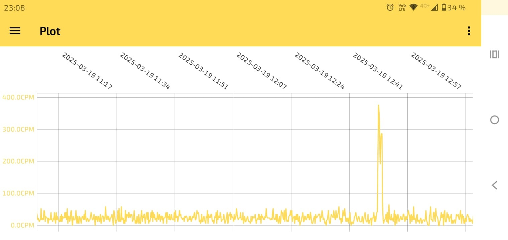

# RadPro Log-Viewer

This android app displays and stores the logged data of Geiger counters with the [Radpro Firmware](https://github.com/Gissio/radpro).

## Features
- Load logged data from Geiger counter.
- Plot logged data.
- Store logged data locally on the android device.
- Combine data from multiple logs of the same Geiger counters and display them in one chart, to get a complete radiation profile of one Geiger counter.
- Adaptive moving average filter with variable filter window, so the radiation plot can be smoothed.
- Export .csv files of logged data in the format "timestamp[unix time],radiation[CPS]"
- The app also has a dark mode, which is set according to the current system mode.

Each datalog is stored on the Android device along with information about the Geiger counter it was loaded from. This allows to store data from multiple Geiger counters.

## Installation
Currently there's just the APK-file provided under the realese section, which can be installed on any android device above android version „Oreo“ 8.0 (API 26). In future it may be provided at the android play store, but for now it is a beta version. 

## To-dos in future

- Add the option to view the chart on a logarithmic scale.
- Expand functionality with additional features, such as live datalogging with GPS tracking.

## Credits
The app uses the following libraries:
- [usb-serial-for-android](https://github.com/mik3y/usb-serial-for-android) - For the serial USB Connection
- [MPAndroidChart](https://github.com/PhilJay/MPAndroidChart) - For plotting the data
- Room - for storing downloaded datalogs persistently
## Screenshots
The peak in the diagram was produced with a check source, to check if it is working correctly.  
  

  

## Personal Motivation
I thought it would be very useful to access the logged data anywhere without needing a computer. Since the only way to view the data was the GeigerLog software, I wanted a simpler solution.
Also I am not a professional App Developer.  
Although I learned Java and JavaFX for desktop applications at university, this is my first Android app. That's why the code is probably not written according to the best design principles.
