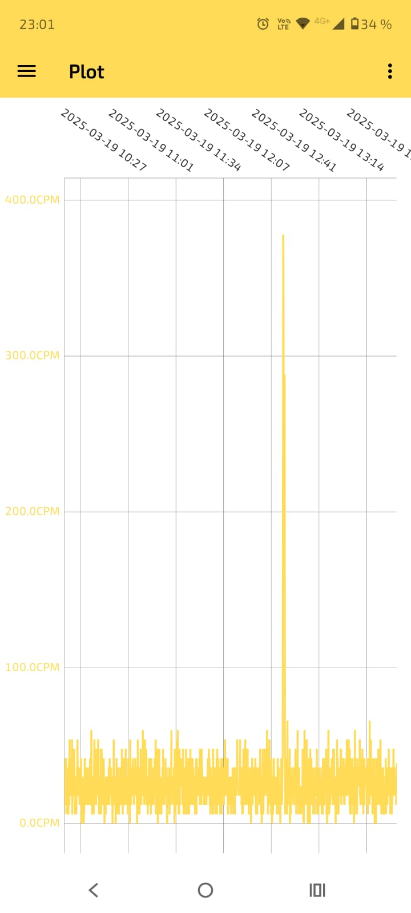

# RadPro Log-Viewer

This Android app displays and stores the logged data of Geiger counters with the [Radpro Firmware](https://github.com/Gissio/radpro).

## Features
- Load logged data from a Geiger counter.
- Plot logged data.
- Store logged data locally on the Android device.
- Combine data from multiple logs of the same device and display them in one chart to get a longer radiation profile.
- Adaptive moving average filter with a variable filter window, allowing the radiation plot to be smoothed.
- Export `.csv` files of logged data.
- Import `.csv` files (the file must follow the CSV format mentioned below).
- The app also supports dark mode, which follows the current system setting.

## CSV Format

The first line contains device information in JSON format, the second line contains the column headers. For example:
>{"conversionValue":153.8,"deviceId":1747642399,"deviceType":"Bosean FS-5000"}  
>time,radiation[CPS]  
>1742588887,0.7  
>1742588887,0.7  

## Installation

Currently, only the APK file is provided under the *Releases* section. It can be installed on any Android device running Android “Oreo” 8.0 (API 26) or above. In the future, it may be published on the Google Play Store, but for now, it is a beta version.

## To-Dos for the Future

- Add the option to view the chart on a logarithmic scale.
- Expand functionality with additional features, such as live data logging with GPS tracking.

## Credits

The app uses the following libraries:
- [usb-serial-for-android](https://github.com/mik3y/usb-serial-for-android) – For the serial USB connection.
- [MPAndroidChart](https://github.com/PhilJay/MPAndroidChart) – For plotting the data.
- Room – For storing downloaded data logs persistently.
- Gson – For serializing the device information to store in the CSV file.

Many thanks also to Gissio, who developed the amazing [Radpro Firmware](https://github.com/Gissio/radpro) that made all of this possible.

## Screenshots

The peak in the diagram was produced using a check source, to verify functionality.  
    

## Personal Motivation

I thought it would be very useful to access the logged data anywhere without needing a computer. Since the only way to view the data was the GeigerLog software, I wanted a simpler solution.  
Please note: I'm not a professional app developer. While I studied Java and JavaFX for desktop applications at university, this is my first Android app. As a result, the code might not follow best design practices and could potentially have some performance issues.
